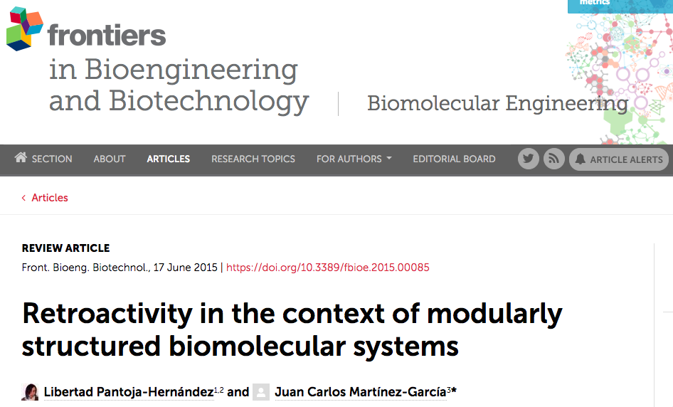

Hello! I am writer and a Data Scientist. I love to draw and to hear good stories. Currently I'm working hard to improve my Data Science skills with the aim to use them to gain insights in biological (specially medical) data.

I am interested in quite a lot of things among of which are:

- **Writing.** You can read a little of what I've done [here](https://libertadph.wordpress.com/).
- **Drawing.** Some of my draws and stuff are either [here](https://magicsuckingmyspine.tumblr.com/) or [here](https://rtonalli.deviantart.com/).
- **Coding.** If you want to check my code or tutorials go [here](https://github.com/LiberPH).
- **Reading.** Lately I am becoming quite lazy, but still you can follow me in [goodReads](https://www.goodreads.com/user/show/1938575-libert).

## My history

Well, I studied Genomic Sciences and I have a PhD in Biomedical Sciences at UNAM. I've been participating in narrative workshops since 2007.

## My publications

During my grad studies I produced two publications:

| Paper             |  Review |
  |  

